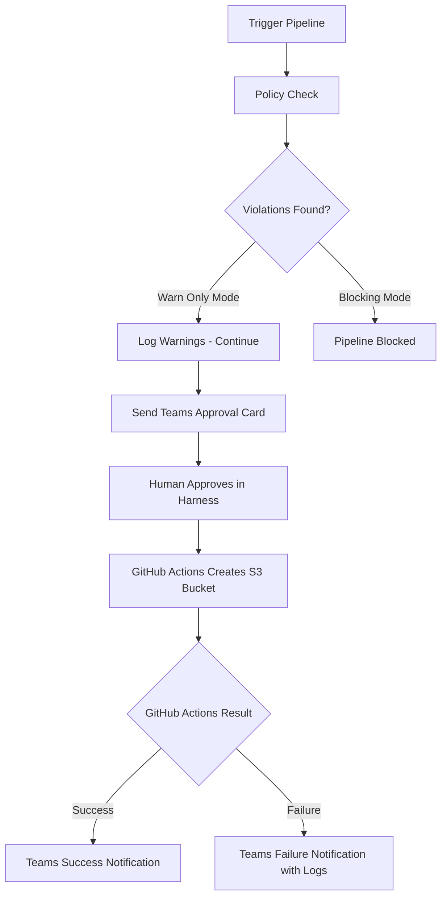

# Harness S3 Policy Accelerator

A ready-to-use Harness accelerator for governed AWS S3 bucket provisioning
with Microsoft Teams approval workflow and Policy-as-Code enforcement.

## What This Accelerator Does



## Included Templates

### Step Templates
| Template | Mode | Description |
|---|---|---|
| s3-policy-warn-only | Warn | Logs violations, pipeline always continues |
| s3-policy-blocking | Block | Stops pipeline immediately on violations |

### Pipeline Templates
| Template | Description |
|---|---|
| s3-provisioning-warn-only | Full S3 pipeline with warn only governance |
| s3-provisioning-blocking | Full S3 pipeline with blocking governance |

## Policy Rules Enforced

| Rule | Warn Only | Blocking |
|---|---|---|
| Bucket name must be lowercase | Warn | Block |
| Bucket name min 5 characters | Warn | Block |
| No underscores or spaces | Warn | Block |
| Must have environment prefix dev staging prod test | Warn | Block |
| Visibility must be private | Warn | Block |

## Repository Structure

```
harness-s3-policy-accelerator/
├── README.md
├── step-templates/
│        ├── s3-policy-warn-only.yaml
│        └── s3-policy-blocking.yaml
├── pipeline-templates/
│         ├── s3-provisioning-warn-only.yaml
│         └── s3-provisioning-blocking.yaml
├── github-actions/
│     └── create-s3-bucket.yml
└── docs/
      ├── prerequisites.md
      └── setup-guide.md
```

## Prerequisites
See [docs/prerequisites.md](docs/prerequisites.md)

## Setup Guide
See [docs/setup-guide.md](docs/setup-guide.md)

## Built With

- [Harness CI/CD](https://harness.io)
- [GitHub Actions](https://github.com/features/actions)
- [Microsoft Teams Webhooks](https://learn.microsoft.com/en-us/microsoftteams/platform/webhooks-and-connectors/what-are-webhooks-and-connectors)
- [AWS S3](https://aws.amazon.com/s3)
